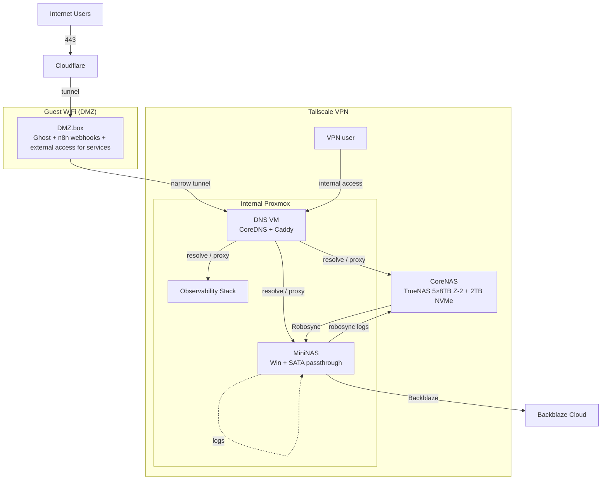

# Network Topology

This document defines the **current network topology** after consolidation around Cloudflare + DMZ ingress + internal Proxmox + NAS tiers. It focuses on trust zones, communication paths, and allowed flows.

---

## Trust Zones

### 1. Public Zone
- Internet users
- Cloudflare edge
- No direct access to internal services

### 2. Guest WiFi DMZ
- Untrusted network
- Hosts **DMZ.box**
- Public-facing workloads only
- No direct LAN or storage access

### 3. Tailscale VPN (Private Mesh)
- Encrypted overlay network
- Internal-only access
- Strong identity-based access

### 4. Internal Infrastructure
- Proxmox cluster
- NAS systems
- Observability stack
- Never exposed publicly

---

## Node Responsibilities

### DMZ.box (Guest WiFi / DMZ)
- Ghost website
- n8n webhook ingress
- External access entrypoint for selected services
- Cloudflared tunnel client
- Only one outbound path: narrow tunnel to DNS VM

### DNS VM (Internal Proxmox)
- CoreDNS
- Caddy reverse proxy
- Central traffic broker
- Entry point for Cloudflare tunnel traffic and VPN user traffic

### CoreNAS
- TrueNAS
- 5×8 TB Z2 + 2 TB NVMe
- Primary storage
- Log sink for backups
- No public exposure

### MiniNAS
- Windows-based NAS
- SATA passthrough
- Backup target and orchestrator
- Forwards offsite backups to Backblaze

### Observability Stack
- Metrics
- Logs
- Monitoring
- Internal only

### VPN User
- Authenticated Tailscale user
- Accesses internal services only via DNS VM

---

## Topology Diagram

---

## Communication Matrix

### Public to DMZ
| Source | Destination | Method | Allowed |
|------|------------|--------|--------|
| Internet | Cloudflare | HTTPS 443 | Yes |
| Cloudflare | DMZ.box | Tunnel | Yes |

### DMZ to Internal
| Destination | Purpose | Allowed |
|------------|--------|--------|
| DNS VM | Reverse proxy, routing | Yes |
| Any other internal node | Direct access | No |

### VPN User to Internal
| Destination | Purpose | Allowed |
|------------|--------|--------|
| DNS VM | Entry point | Yes |
| Other nodes | Direct | No |

### Internal Flows
| Source | Destination | Purpose | Allowed |
|------|------------|--------|--------|
| DNS VM | CoreNAS | Service proxy | Yes |
| DNS VM | MiniNAS | Service proxy | Yes |
| DNS VM | Observability | Metrics and UI | Yes |
| CoreNAS | MiniNAS | Backup (Robosync) | Yes |
| MiniNAS | CoreNAS | Backup logs | Yes |
| MiniNAS | Backblaze | Offsite backup | Yes |

---

## Network Rules Summary

### DMZ.box
- No LAN trust
- No NAS access
- No lateral movement
- Single narrow tunnel only

### DNS VM
- Central choke point
- All ingress funnels through it
- No public exposure

### Internal Nodes
- No public ingress
- No DMZ trust
- Mesh-only access

---

## Architectural Outcome

- Single controlled ingress point
- Minimal blast radius
- Clear separation of ingress, routing, storage, and backups
- Strong zero-trust posture without over-complexity

---

---

## Changelog

### v2 – 2025-12-23
- Replaced Core/Infra split with DNS VM as central ingress choke point
- Introduced Guest WiFi DMZ with narrow tunnel model
- Clarified VPN user access path restrictions
- Split primary storage and backup responsibilities across CoreNAS and MiniNAS

### v1 – Initial
- Original Core / Infra / DMZ topology

