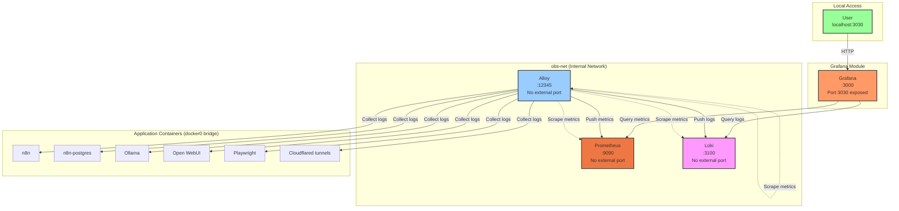

# Phase 2: Grafana Deployment - COMPLETE ✅

**Completion Date**: 2025-11-15

## What Was Deployed

### Directory Structure
```
observability/
├── obs-core/                    # Phase 1 - Core telemetry (Alloy, Prometheus, Loki)
│   ├── docker-compose.yml
│   ├── .env
│   ├── alloy-config.alloy
│   ├── prometheus/
│   │   └── prometheus.yml
│   └── loki/
│       └── loki-config.yml
└── grafana/                     # Phase 2 - Visualization layer
    ├── docker-compose.yml
    ├── .env
    ├── provisioning/
    │   ├── datasources/
    │   │   ├── prometheus.yml
    │   │   └── loki.yml
    │   ├── dashboards/
    │   │   └── dashboards.yml
    │   └── alerting/           # (Future - Phase 5)
    ├── dashboards/
    │   └── system-health.json
    └── docs/
        └── rbac-model.md
```

## Services Running

### Grafana Module
- **grafana** - Visualization & alerting platform
  - Version: 11.3.0
  - Port: 3030 (local access only)
  - Network: obs-net
  - Health check: ✅ Enabled

## Configuration Completed

### ✅ Data Sources (Auto-provisioned)
- **Prometheus** (uid: prometheus)
  - URL: http://prometheus:9090
  - Default: Yes
  - Status: Connected ✅
  
- **Loki** (uid: loki)
  - URL: http://loki:3100
  - Default: No
  - Status: Connected ✅

### ✅ Dashboards
- **System Health** (uid: system-health)
  - Prometheus/Loki/Alloy status panels
  - Container status over time graph
  - All containers status table
  - Auto-refresh: 30s

### ✅ RBAC Configuration
- Admin role: System owner (configured in .env)
- Editor role: Documented for future operators
- Viewer role: Documented for future stakeholders
- Service accounts: Reserved for Phase 5 (n8n integration)

## Security Posture

### Ports Exposed
- ✅ **Grafana**: 3030 → 3000 (local access only)
- ❌ **Prometheus**: No external port (obs-net only)
- ❌ **Loki**: No external port (obs-net only)
- ❌ **Alloy**: No external port (obs-net only)

### Access Control
- Admin password: Configured in grafana/.env
- Anonymous access: Disabled
- User sign-up: Disabled
- Datasource editing: Locked (provisioned via code)

## What's Working

### ✅ Core Monitoring
- All Docker containers discovered and monitored
- Real-time container up/down status
- Service health checks (Prometheus, Loki, Alloy)
- Log aggregation from all containers

### ✅ Visualization
- Single pane of glass for observability
- Auto-refreshing dashboards
- Historical data (Prometheus: 180d, Loki: 90d)

## What's NOT Working (By Design)

### ❌ Container Resource Metrics
- CPU usage, memory usage, network I/O
- **Reason**: Requires cAdvisor metrics collection
- **Planned**: Phase 5 (Alerting & Monitoring)

### ❌ External Access
- Grafana only accessible via localhost:3030
- **Reason**: VPN access planned (not Cloudflare tunnel)
- **Planned**: Future VPN setup

### ❌ Alerting
- No alert rules configured yet
- No notification channels
- **Planned**: Phase 5

## Access Information

### Grafana Web UI
- **URL**: http://localhost:3030
- **Username**: (see grafana/.env)
- **Password**: (see grafana/.env)

### Data Sources (Internal Only)
- Prometheus: http://prometheus:9090 (via obs-net)
- Loki: http://loki:3100 (via obs-net)

## Verification Commands

```bash
# Check all services are running
docker ps | grep -E "(grafana|prometheus|loki|alloy)"

# Check Grafana logs
cd ~/docker/observability/grafana && docker compose logs -f

# Check obs-core logs
cd ~/docker/observability/obs-core && docker compose logs -f

# Test Prometheus connectivity
docker exec grafana curl -s http://prometheus:9090/api/v1/status/config | head -20

# Test Loki connectivity
docker exec grafana curl -s http://loki:3100/ready
```

## Troubleshooting

### Dashboards show "No data"
1. Check datasource UIDs match: Connections → Data sources
2. Prometheus UID should be: `prometheus`
3. Loki UID should be: `loki`
4. If wrong, delete datasources and restart Grafana (reprovisioning)

### Cannot access Grafana
1. Check container is running: `docker ps | grep grafana`
2. Check port mapping: `docker port grafana`
3. Should show: `3000/tcp -> 0.0.0.0:3030`

### Datasources show "Unable to connect"
1. Verify obs-net exists: `docker network ls | grep obs-net`
2. Verify Grafana is on obs-net: `docker inspect grafana | grep obs-net`
3. Test connectivity from Grafana container (see Verification Commands)

## Next Steps: Phase 5 - Alerting & Monitoring

### Planned Work
1. Add cAdvisor metrics collection to Alloy
2. Configure baseline alerts:
   - Container down
   - High CPU/RAM/Disk
   - Scrape failures
3. Set up notification channels
4. Import standard Docker dashboards
5. Configure n8n webhook integration
6. Add Proxy SLO alerts (Phase 4 dependency)

### Prerequisites
- Phase 1: ✅ Complete
- Phase 2: ✅ Complete
- Phase 3: ⏭️ Skipped (using VPN instead)
- Phase 4: ⏭️ Pending (AI Proxy deployment)

## Files to Backup

Critical configuration files (commit to git):
```
observability/grafana/.env                        # Admin credentials
observability/grafana/provisioning/datasources/*  # Datasource config
observability/grafana/provisioning/dashboards/*   # Dashboard providers
observability/grafana/dashboards/*                # Dashboard JSON files
observability/obs-core/.env                       # Core stack config
observability/obs-core/alloy-config.alloy         # Alloy telemetry config
observability/obs-core/prometheus/prometheus.yml  # Prometheus config
observability/obs-core/loki/loki-config.yml       # Loki config
```

## Changes from Phase 1

### Added
- Grafana OSS 11.3.0
- Prometheus datasource (auto-provisioned)
- Loki datasource (auto-provisioned)
- System Health dashboard
- RBAC documentation

### Removed
- Temporary port mappings from obs-core services
- Prometheus port 9090 (was for testing)
- Loki port 3120 (was for testing)
- Alloy port 12345 (was for testing)

### Kept
- Grafana port 3030 (local access for administration)

## Architecture



---

**Phase 2 Status**: ✅ **COMPLETE**

All objectives achieved. System is operational and ready for Phase 5 (Alerting & Monitoring).